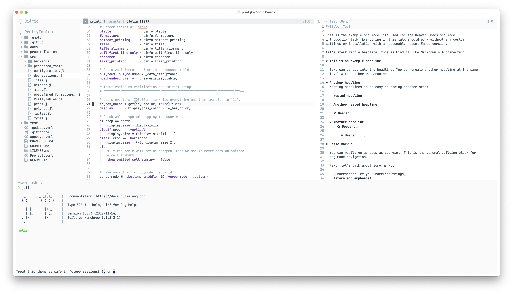
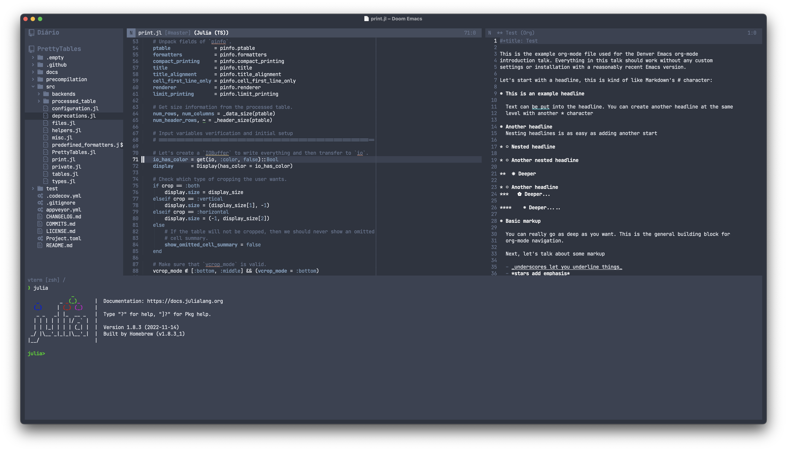

# Doom N Λ N O Themes

This package contains an attempt to replicate [N Λ N O
Theme](https://github.com/rougier/nano-theme) using Doom themes framework.
Hence, it can work properly when using Doom Emacs.

## Installation

First, copy the files to `~/.doom.d/themes/` or
`~/config/doom/themes/` depending on your local setup.

If you are using Doom Emacs, add to your `config.el`:

```emacs-lisp
(after! doom-themes
  (load-theme 'doom-nano-light t))
```

or

```emacs-lisp
(after! doom-themes
  (load-theme 'doom-nano-dark t))
```

depending on the theme variant you like.

If you are not using Doom Emacs, just select the theme inside `use-package` call
as mentioned in [doom-themes documentation](https://github.com/doomemacs/themes).

## Screenshot

### Light theme



### Dark theme


